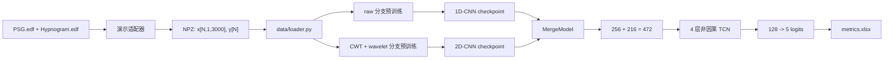

# FFTCN 原仓库代码导览与贯通操作手册

## 0. 这份手册解决什么问题

论文回答“为什么这样设计”，代码回答“数据以什么形状进入哪个对象、由谁训练、权重保存在哪里”。

本手册先用 6 条真实 Sleep-EDF 记录、每阶段 1 个 epoch，贯通原仓库的主要代码路径。目标是理解文件关系和运行顺序，不是得到有效精度，更不是宣称复现论文指标。

计划已在 2026-07-09 调整：本手册对应的是里程碑 1A“原仓库代码导览”。真正用于判断论文结果是否大致可信的步骤，改为新增里程碑 1B“原仓库结果级直接复现预检”。因此不要把本手册中的 4% 演示 ACC 或 1 epoch 流程当作直接复现结论。

本次贯通没有修改 `models/` 下的核心模型代码。新增脚本只负责：

1. 把少量真实 EDF 适配成原仓库要求的 `.npz`；
2. 用较小的训练轮数调用原仓库类；
3. 保存形状、权重、曲线和指标文件，供学习。

### 0.1 变更标记规则

从本版手册开始，涉及代码或运行行为的内容使用以下标记：

- **[原仓库未改]**：直接调用或观察原始实现；
- **[本项目新增]**：为下载、诊断、导览或正式复现新增的文件；
- **[演示配置覆盖]**：不改核心类，只在外部脚本传入更小的数据或参数；
- **[已发现未修改]**：已经确认问题，但当前阶段为保持原始行为而没有修复。

判断一个改动是否合理时，依次问三个问题：

1. 原代码为什么不能满足当前输入或运行环境？
2. 改动能否放在边界适配层，而不是直接侵入模型核心？
3. 改动是否改变实验语义；如果改变，结果还能不能与论文比较？

### 0.2 本次实际代码变更总览

| 位置 | 标记 | 为什么需要 | 为什么这样处理 | 可迁移经验 |
|---|---|---|---|---|
| `scripts/run_original_code_walkthrough.py` | 本项目新增 | 原 trainer 路径、轮数和数据格式均固定，不能直接读取 Sleep-EDF | 在核心模型外建立适配和编排层，调用原有 Loader/Model | 第三方研究代码先做“薄适配层”，不要先重写算法 |
| 脚本中的仓库根目录 `sys.path` 注入 | 本项目新增 | 直接执行 `scripts/*.py` 时 Python 只自动加入 `scripts/`，找不到顶层 `data/models` | 根据 `__file__` 计算仓库根目录并加入模块搜索路径 | 遇到 `ModuleNotFoundError` 先检查启动位置和 `sys.path`，不要盲目重装包 |
| EDF→演示 `.npz` 适配 | 本项目新增 | 原 `Sleep_Loader` 只接受 `x/y` 的 `.npz` | 只转换 6 条真实记录到既有数据契约，不改 Loader | 优先让新数据适配稳定接口，而不是让核心模块同时支持所有格式 |
| 每阶段 1 epoch、6 条记录 | 演示配置覆盖 | 原 20/20/50 轮不适合第一次代码导览 | 通过函数参数缩小运行，不改训练函数 | 冒烟测试先验证控制流、形状和梯度，再投入完整算力 |
| `walkthrough/` 输出目录 | 本项目新增 | 原输出固定在作者本机路径，且演示结果可能污染正式实验 | 单独隔离演示数据、权重和指标 | 不同实验语义必须使用不同输出根目录 |
| `run_summary.json` 中将非有限指标写为 `null` | 本项目新增 | 原指标可能产生 NaN；JSON 标准不应依赖非标准 `NaN` 字面量 | 保留“无有效数值”的事实，不伪造 0 | 序列化前显式处理 NaN/Inf，并记录产生原因 |
| `.gitignore` 忽略 `datasets/**/*.edf` 与 `walkthrough/` | 本项目新增 | 原始数据和模型权重大，不应误提交 | 只忽略可再生成的大文件，保留脚本与小型摘要 | 版本控制保存“生成方法和证据”，不默认保存大产物 |
| `models/**` | 原仓库未改 | 需要观察原始仓库真实行为 | 通过外部脚本调用，不在导览阶段修复核心问题 | 先建立可重复基线，再逐项修改和回归测试 |

## 1. 先记住一条主线



原仓库不是“一次启动一个模型完成所有工作”，而是三个入口按顺序执行：

1. `models/raw/trainer.py`：预训练 1D-CNN；
2. `models/wavelet/trainer.py`：预训练 2D-CNN；
3. `models/merge/trainer.py`：加载前两个检查点，微调整体 FFTCN。

图中的“演示适配器”是 **[本项目新增]**，从 `.npz` 进入 Loader 后的网络主链均为 **[原仓库未改]**。

## 2. 论文概念与代码位置

下表列出的 `data/loader.py`、`data/wavelet_torch.py` 和 `models/**` 均为 **[原仓库未改]**；本次只观测它们的真实调用和输出形状。

| 论文概念 | 主要代码 | 代码职责 |
|---|---|---|
| 30 秒单通道 EEG | `data/loader.py` | 读取 `[N,1,3000]` |
| Morlet CWT | `data/wavelet_torch.py` | 在 GPU 上生成 `[N,1,30,60]` |
| 1D-CNN 时域特征 | `models/raw/network.py` | `RawFeatureNet` 输出 256 维 |
| 2D-CNN 时频特征 | `models/wavelet/network.py` | `WaveFeatureNet` 输出 216 维 |
| 特征融合 | `models/merge/network.py` | 在最后一维拼接为 472 维 |
| 非因果扩张卷积 | `models/base/tcn.py` | dilation 为 `1,2,4,8`，保持序列长度 |
| 序列分类 | `MergeSleepNet` | `472 -> TCN 128 -> Linear 5` |
| 两阶段训练 | 三个 `model.py` 和 `trainer.py` | 两分支预训练后进行整体微调 |
| 类别不平衡 | `data/resample.py` | 偏移过采样；只用于单时段预训练 |
| ACC/F1/Kappa | `models/base/utils.py` | `Metrics` 计算并导出 Excel |

## 3. 应该按什么顺序读代码

不要从 trainer 的第一行开始逐句读。对每条模型分支，按下面顺序阅读：

1. `parameter.py`：先知道网络层参数和形状目标；
2. `network.py`：看张量如何经过网络；
3. `model.py`：看优化器、学习率和训练阶段；
4. `trainer.py`：最后看数据路径和超参数如何组装。

推荐的完整阅读次序：

1. `models/raw/parameter.py`
2. `models/raw/network.py`
3. `models/wavelet/parameter.py`
4. `models/wavelet/network.py`
5. `models/base/tcn.py`
6. `models/merge/parameter.py`
7. `models/merge/network.py`
8. `data/loader.py`
9. 三个 `model.py`
10. 三个 `trainer.py`
11. `models/base/model.py` 和 `models/base/utils.py`

## 4. 各目录和文件的作用

### 4.1 `data/`

| 文件 | 来源 | 是否为主链 | 作用与注意点 |
|---|---|---|---|
| `loader.py` | 原仓库未改 | 是 | 从多个 `.npz` 读 `x/y`，按文件划分集合，按需计算 CWT，返回 DataLoader |
| `wavelet_torch.py` | 原仓库未改 | 是 | PyTorch/GPU 版 Morlet CWT；原代码默认固定使用 `cuda:0` |
| `wavelet.py` | 原仓库未改 | 参考 | NumPy/SciPy 版 CWT，可作为数值参考 |
| `resample.py` | 原仓库未改 | 是 | 预训练时使用偏移过采样；要求 `seq_len=1` |
| `preprocessor.py` | 原仓库未改 | 不直接运行 | 针对作者本地 SHHS `.npz`，包含硬编码路径和多段顶层脚本 |
| `de.py` | 原仓库未改 | 非 FFTCN 主链 | 差分熵/PSD 工具，当前 FFTCN 贯通没有调用 |
| `sleep_edf_reader.py` | 本项目新增 | 后续正式主链 | 里程碑 2 的 Sleep-EDF 用户练习接口，不属于原仓库 |

### 4.2 `models/raw/`

| 文件 | 作用 |
|---|---|
| `parameter.py` | 1D 卷积、池化、TCN 和分类头参数 |
| `network.py` | `RawFeatureNet` 与 `RawSleepNet` |
| `model.py` | `RawModel.pretrain/finetune` |
| `trainer.py` | 原作者训练入口；路径固定为 `D:\BJM\testdata` |

`RawFeatureNet` 有两个模式：

- `pretrain()`：启用五分类头，输出 `[B,5]`；
- `finetune()`：关闭分类头，输出 `[B,256]`。

### 4.3 `models/wavelet/`

结构与 raw 分支相同：

- `WaveFeatureNet.pretrain()` 输出 `[B,5]`；
- `WaveFeatureNet.finetune()` 输出 `[B,216]`。

仓库实际只启用四个卷积池化块。`network.py` 中第五块被注释，因此最终为 `72×1×3=216`，不是论文版本的 432。

### 4.4 `models/base/`

| 文件 | 作用 |
|---|---|
| `tcn.py` | 非因果 same-padding TCN、扩张卷积和残差连接 |
| `model.py` | 通用训练、验证、保存曲线和模型 |
| `utils.py` | 模型摘要、EarlyStopping、指标和 Excel 导出 |
| `layers.py` | LSTM 等备用层；当前主链采用 TCN |
| `parameter.py` | 其他历史模型参数，不是当前 FFTCN 主参数 |

### 4.5 `models/merge/`

`MergeModel` 加载两个预训练模型，从中取出 `.feature_net`：

```text
Raw checkpoint  -> net.feature_net -> 256 维
Wave checkpoint -> net.feature_net -> 216 维
拼接                               -> 472 维
TCN                                -> 128 维
Linear                             -> 5 类 logits
```

## 5. 原仓库真实期望的数据格式

原 `Sleep_Loader` 不读取 EDF。它遍历目录下的 `.npz`：

```text
x: float, [N, 1, 3000]
y: integer, [N]
```

当 `seq_len=50` 时，Loader 把它重排为：

```text
raw:      [batch, 50, 1, 3000]
wavelet:  [batch, 50, 1, 30, 60]
label:    [batch, 50]
```

原 Loader 按排序后的文件名切分 train/valid/test，而不是按受试者 ID 切分。对 Sleep-EDF 正式实验必须改为受试者级划分，否则同一受试者的两晚可能泄漏到不同集合。

**为什么不在这次导览中直接修改 Loader？** Loader 是原仓库数据主入口，立刻改写会混淆“原始行为”和“正式复现行为”。因此本次用 **[本项目新增]** 的适配器先生成兼容 `.npz`；里程碑 2–3 再用测试驱动方式正式实现 EDF 读取和受试者划分。这是“先建立基线，再改变契约”的做法。

## 6. 从头执行本次代码导览

请先进入克隆后的仓库根目录；下文所有项目文件路径都相对于该目录。

### 第一步：检查环境

`scripts/milestone_1_check.py` 是 **[本项目新增]**。原仓库没有依赖检查或锁定文件，因此用独立脚本记录解释器、包版本、驱动和 CUDA 可用性，而不把环境判断写进模型代码。

```powershell
python `
  .\scripts\milestone_1_check.py `
  --output .\reproduction_artifacts\milestone_01\environment_d21_report.json
```

应看到：

- Python 3.10.13；
- PyTorch 1.12.1；
- CUDA 11.6；
- `cuda_available: true`；
- pyEDFlib 0.1.42。

环境还补装了 `openpyxl 3.1.5`：`pyEDFlib` 用于读取原仓库不支持的 EDF，`openpyxl` 是原 `Metrics.save_metrics()` 到运行末端才会导入的直接依赖。经验是：不仅要测试模型 import，还要覆盖保存和报告路径，才能发现延迟导入依赖。

### 第二步：确认原始数据

```powershell
Get-ChildItem `
  .\datasets\sleep-edf-expanded-1.0.0\sleep-cassette\*-PSG.edf |
  Measure-Object
```

数量应为 153。

### 第三步：只准备演示 `.npz`

这是 **[本项目新增]** 的边界适配步骤。它没有改变 1D-CNN、2D-CNN、TCN 或训练循环。

```powershell
python `
  .\scripts\run_original_code_walkthrough.py `
  --prepare-only
```

它从 6 条真实记录各选一个连续 50 段、包含五类的窗口，生成：

```text
walkthrough/data/SC4001.npz
walkthrough/data/SC4002.npz
walkthrough/data/SC4021.npz
walkthrough/data/SC4022.npz
walkthrough/data/SC4031.npz
walkthrough/data/SC4032.npz
```

这些文件仅用于理解程序调用，不是正式数据预处理结果。

选择“连续 50 段且五类均出现”有两个原因：`T=50` 与完整 FFTCN 的序列契约一致；五类均出现可避免原训练代码根据缺失类别构造出长度不足的 class-weight 向量。该选择改变了数据抽样分布，所以只能用于控制流演示。

### 第四步：检查一个输入文件

```powershell
python -c `
  "import numpy as np; f=np.load(r'walkthrough/data/SC4001.npz'); print(f['x'].shape, f['x'].dtype, f['y'].shape, np.unique(f['y'], return_counts=True))"
```

应看到 `x.shape == (50,1,3000)`，标签只包含 `0..4`。

### 第五步：执行完整贯通

这是 **[演示配置覆盖]**：脚本把原 trainer 的 20/20/50 epoch 改为调用相同 `pretrain/finetune` 方法各 1 epoch，并把 batch size 调小。核心训练方法、损失、优化器类型和网络均未修改。

```powershell
python `
  .\scripts\run_original_code_walkthrough.py
```

运行顺序是：

1. 加载三条训练记录、一条验证记录、两条测试记录；
2. 1D-CNN 预训练 1 轮；
3. 对 EEG 执行 CWT，2D-CNN 预训练 1 轮；
4. 保存两个 checkpoint；
5. `MergeModel` 加载两个 checkpoint；
6. 以 `T=50` 微调整体 FFTCN 1 轮；
7. 执行测试并生成 Excel 指标。

首次运行通常会出现 `torch.tensor(sourceTensor)` 警告，来源是原始 `data/wavelet_torch.py`。它不阻止本次运行，但正式整理时应改为 `clone().detach()` 或避免重复构造。

导览脚本显式把仓库根目录加入 `sys.path`，这是 **[本项目新增]** 的启动修复。原因是直接执行文件时 `sys.path[0]` 指向 `scripts/`。相似问题的排查顺序应是：确认当前目录 → 打印 `sys.path` → 确认包是否有正确根目录 → 再决定使用 `python -m package.module`、安装为包或显式加入根目录。

## 7. 本次实际观测到的形状

| 节点 | 实际形状 |
|---|---|
| 1D 预训练输入 | `[16,1,3000]` |
| 2D 预训练输入 | `[16,1,30,60]` |
| FFTCN raw 输入 | `[1,50,1,3000]` |
| FFTCN wave 输入 | `[1,50,1,30,60]` |
| 展平的 raw epoch | `[50,1,3000]` |
| raw 特征 | `[50,256]` |
| wave 特征 | `[50,216]` |
| 融合序列 | `[1,50,472]` |
| TCN 表征 | `[1,50,128]` |
| 仓库最终 logits | `[50,5]` |

这里最后的 `[50,5]` 是因为 `MergeSleepNet.forward()` 在分类前把 batch 和 sequence 展平。若 batch 为 2，实际返回 `[100,5]`；调用方同时把标签展平为 `[100]`。

## 8. 输出文件如何阅读

### 8.1 机器可读摘要

`reproduction_artifacts/code_walkthrough/run_summary.json` 包含：

- 演示记录和窗口起点；
- 每个 batch 与中间特征形状；
- 参数量；
- checkpoint 路径；
- 各阶段运行时间；
- 演示指标。

摘要生成器是 **[本项目新增]**。它只读取运行中的张量和原模型输出，不改变模型前向过程。原指标产生 NaN 时，摘要写为 JSON `null`；这是表示“不可用”，不是把结果修正为 0。

### 8.2 训练输出

```text
walkthrough/outputs/
├─ RawModel/1D-CNN/
│  ├─ network.pth
│  ├─ pretrainhis.npz
│  └─ pretrainhis.png
├─ WaveletModel/2D-CNN/
│  ├─ network.pth
│  ├─ pretrainhis.npz
│  └─ pretrainhis.png
└─ MergeModel/FFTCN/
   ├─ network.pth
   ├─ best_network.pth
   ├─ finetunehis.npz
   ├─ finetunehis.png
   └─ metrics.xlsx
```

- `network.pth`：当前阶段最终模型；
- `best_network.pth`：EarlyStopping 记录的最低验证损失模型；
- `*his.npz`：训练/验证 loss 和 accuracy；
- `*his.png`：相同历史的曲线；
- `metrics.xlsx`：混淆矩阵、分类指标和总体指标。

## 9. 为什么演示精度不能用于结论

本次只使用 6 条记录、每条 50 段、每阶段 1 轮。测试准确率约 4%，其数值本身没有研究意义。

原 `Metrics.precision_score()` 在某一预测列计数为零时直接做除法，因此出现 `NaN`，宏 F1 也变为 `NaN`。这说明“程序完整执行”和“指标实现稳健”是两个不同的验收层次。

## 10. 原仓库直接运行前必须知道的问题

以下均为 **[已发现未修改]**。保留原行为是为了让本次贯通成为可比较基线；正式修复时必须为每项添加测试并在对应里程碑手册中记录原因。

1. 三个 trainer 都硬编码 `D:\BJM\testdata` 和 `D:\BJM\test_outputs`。
2. 原仓库只提供 SHHS `.npz` Loader，不提供 Sleep-EDF EDF Reader。
3. `data/preprocessor.py` 含多段顶层执行代码，不应直接 import 或运行。
4. 数据划分按文件，不按受试者，正式 Sleep-EDF 实验存在泄漏风险。
5. CWT 默认设备固定为 `cuda:0`，CPU 环境会失败。
6. Loader 初始化时一次性计算并缓存 CWT，大数据集可能耗尽内存。
7. 模型保存的是完整 Python 对象，而不是 `state_dict`，跨版本加载较脆弱。
8. 最终 logits 把 batch 和时间维展平，需要调用方知道这一契约。
9. 指标除零会产生 `NaN`。
10. 仓库没有依赖锁定文件，README 的 Python/PyTorch 版本已陈旧。

这些问题不意味着模型思想无效，只说明原仓库更接近研究原型，而不是可直接复现实验的工程项目。

### 10.1 将来修改这些问题时的原则

| 问题类型 | 不推荐的反应 | 推荐处理 |
|---|---|---|
| 硬编码路径 | 在多个源文件里替换成自己的绝对路径 | 增加 CLI/config，并让路径从入口向下传递 |
| 输入格式不一致 | 把 EDF 解析塞进模型 `forward()` | 在数据边界转换为稳定张量契约 |
| 设备写死 | 全局搜索替换 `cuda:0` | 从入口创建 `device`，通过构造参数传入 |
| 输出形状含糊 | 在多个调用方反复猜测 reshape | 明确接口契约，并用形状测试锁定 |
| 指标 NaN | 用 `nan_to_num` 静默变成 0 | 先定义零分母语义，再加入人工构造测试 |
| 完整对象 checkpoint | 只要当前机器能 load 就忽略 | 保存 `state_dict + config + label metadata` |

## 11. 导览结束后如何回到正式复现

代码导览不会替代原计划中的任何数据或模型验收。根据 2026-07-09 的计划调整，下一步不再直接回到后续教学练习，而是先进入里程碑 1B：

1. 在已完成 Sleep-EDF 读取、预处理和受试者级划分的基础上，解析原仓库完整训练/评估链路；
2. 只对数据接口、路径/配置、设备、指标和 checkpoint 等边界层做必要修改；
3. 为每个修改点记录原代码行、修改代码行、修改原因、输入输出变化和验证方法；
4. 用小规模 dry-run 或 1 epoch 确认修改正确；
5. 用户再启动较长训练，得到测试集 ACC、宏 F1、kappa、各类 F1 和混淆矩阵；
6. Codex 对照论文结果判断“可信 / 存疑但可继续 / 不可信应放弃”。

导览阶段的权重、曲线和指标统一位于 `walkthrough/`，不得与后续正式实验输出混用。

后续只要代码发生变化，都应在对应里程碑手册中至少记录：修改位置、原问题、修改理由、是否改变实验语义、验证命令和回退方式。无需逐行解释，但不能只写“修复 bug”或“优化代码”。

## 12. 学习验收清单

完成本手册后，应能回答：

- 为什么必须先分别训练 raw 和 wavelet 分支？
- `pretrain()` 与 `finetune()` 如何改变 FeatureNet 的输出？
- 256、216、472 和 128 分别在哪个文件中产生？
- CWT 是离线文件还是 Loader 初始化时动态计算？
- 两个 checkpoint 如何被 `MergeModel` 取出并复用？
- 为什么仓库返回 `[B*T,5]`？
- 为什么这次 4% accuracy 不能用于判断论文模型性能？
- 为什么正式数据划分必须从“文件级”改成“受试者级”？
